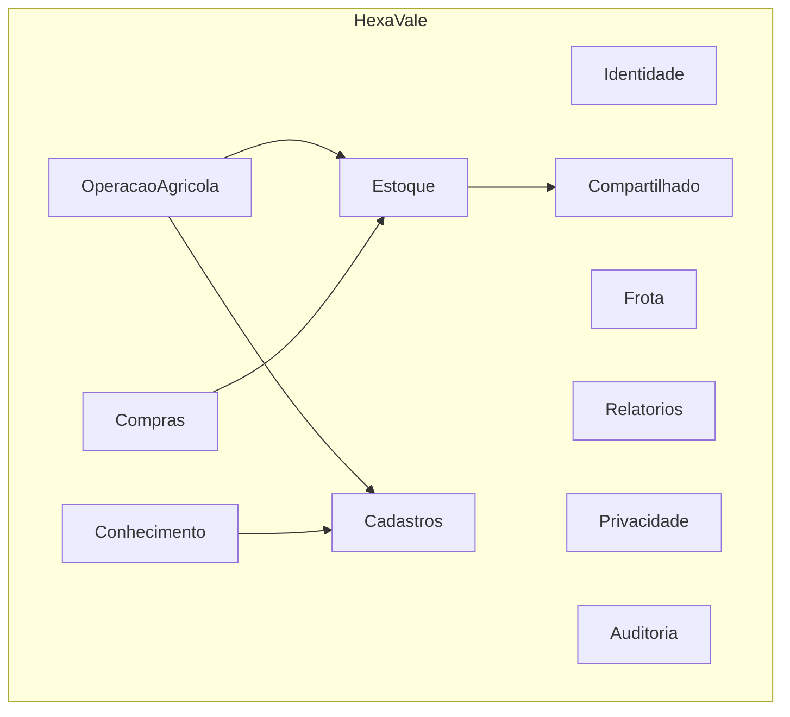

# C4 — Componentes (contextos)

```mermaid
flowchart TB
  subgraph hex [HexaVale]
    Id[Identidade]
    Cad[Cadastros]
    Est[Estoque]
    Comp[Compras]
    Op[OperacaoAgricola]
    Fro[Frota]
    Rel[Relatorios]
    Con[Conhecimento]
    Priv[Privacidade]
    Aud[Auditoria]
    Share[Compartilhado]
  end
  Op --> Est
  Comp --> Est
  Op --> Cad
  Est --> Share
  Con --> Cad
```

Cada contexto: Dominio → Aplicacao → Infraestrutura / Interface.
