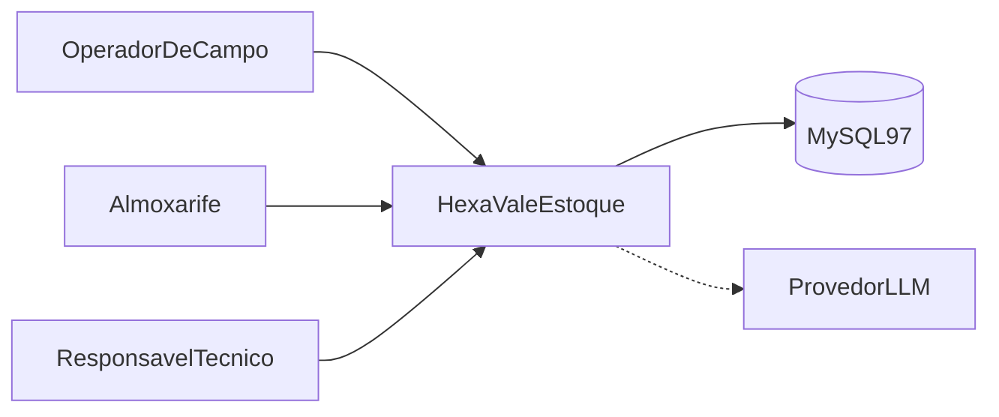

# C4 — Contexto

```mermaid
flowchart LR
  Operador[OperadorDeCampo]
  Almox[Almoxarife]
  RT[ResponsavelTecnico]
  Sistema[HexaValeEstoque]
  MySQL[(MySQL97)]
  LLM[ProvedorLLM]
  Operador --> Sistema
  Almox --> Sistema
  RT --> Sistema
  Sistema --> MySQL
  Sistema -.-> LLM
```

Atores internos usam PWA/web. LLM só no módulo Conhecimento (Fase 9), com redação de PII.
